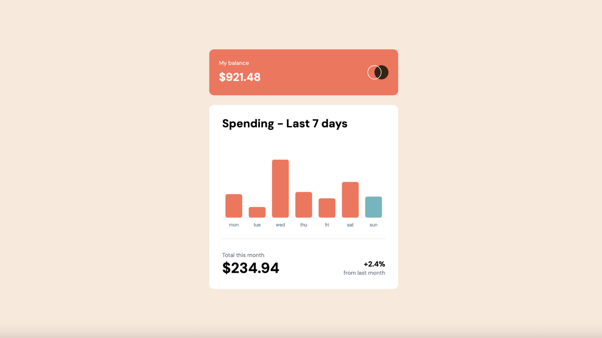

# Expenses Chart Component

This is a solution to the [Expenses chart component challenge on Frontend Mentor](https://www.frontendmentor.io/challenges/expenses-chart-component-e7yJBUdjwt).

## Overview

In this Next.js, TypeScript and Tailwind app, I dynamically present JSON chart data using Chart.js.

Bars are represented by the amount of spending, and the current day as per the user's locale is highlighted with a different colour bar.

### The challenge

Users should be able to:

- View the bar chart and hover over the individual bars to see the correct amounts for each day
- See the current day’s bar highlighted in a different colour to the other bars
- View the optimal layout for the content depending on their device’s screen size
- See hover states for all interactive elements on the page
- Use the JSON data file provided to dynamically size the bars on the chart

### Screenshot Preview

### Links

- Live Site URL: [https://expenses.adamrichardturner.dev/](https://expenses.adamrichardturner.dev/)

### Built with

- [React](https://reactjs.org/) - JS library
- [Next.js](https://nextjs.org/) - React framework
- [Tailwind CSS](https://tailwindcss.com/) - For styles
- [TypeScript](https://www.typescriptlang.org/) - Programming Language
- [Chart.js](https://www.chartjs.org/) - Package for building dynamic charts
